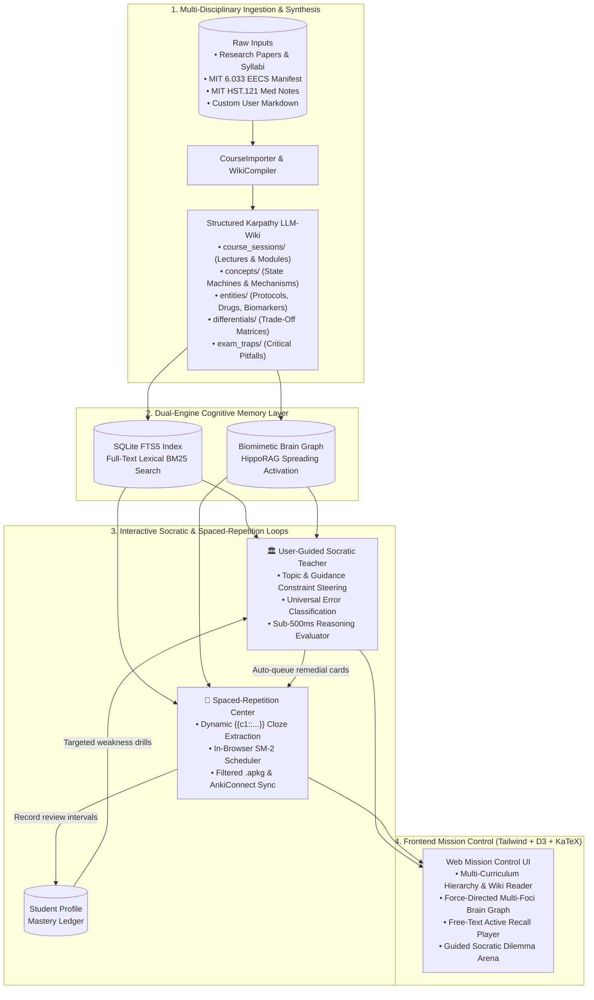
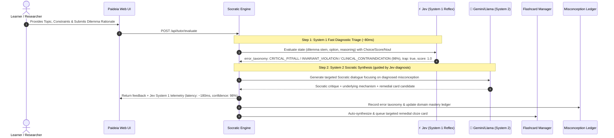

# Paideia Genesis: Universal Living Education Assistant & Compounding LLM-Wiki

<div align="center">

```
   ____       _     _      _          ____                       _     
  |  _ \ __ _(_) __| | ___(_) __ _   / ___| ___ _ __   ___  ___(_)___ 
  | |_) / _` | |/ _` |/ _ \ |/ _` | | |  _ / _ \ '_ \ / _ \/ __| / __|
  |  __/ (_| | | (_| |  __/ | (_| | | |_| |  __/ | | |  __/\__ \ \__ \
  |_|   \__,_|_|\__,_|\___|_|\__,_|  \____|\___|_| |_|\___||___/_|___/
                               [ M Σ ]
                      ⚕  S C O O Z I   L A B S  ⚕
```

### 🧠 Scoozi Labs &bull; Paideia Genesis 🏛
**An Autonomous Living Education Assistant & Compounding LLM-Wiki for All Disciplines**
*Deep Learning / ML Research &bull; Computer Systems & Engineering &bull; Mathematics &bull; Medicine &bull; Humanities*

[](https://www.python.org/downloads/)
[](https://fastapi.tiangolo.com)
[](#-kahneman-dual-process-cognitive-architecture-system-1-jev--system-2-gemini--llama)
[](#-kahneman-dual-process-cognitive-architecture-system-1-jev--system-2-gemini--llama)
[](https://opensource.org/licenses/MIT)
[](#curriculum-architecture)
[](#4-running-the-automated-test-suite)
[](#2--biomimetic-cognitive-brain-graph-hipporag)

*Built on Andrej Karpathy's LLM-Wiki architecture, integrating Daniel Kahneman Dual-Process AI (Jev System 1 <100ms decision primitives + Gemini/Llama System 2 analytical reasoning), multi-domain HippoRAG associative graph memory, and SuperMemo-2 active recall across any discipline.*

</div>

---

## 🌟 Overview

Whether preparing for high-stakes professional exams (USMLE Step 1/2), conducting cutting-edge **Deep Learning / Machine Learning research**, mastering **Distributed Systems and Computer Engineering**, or tackling advanced mathematics, learners and researchers confront the same fundamental challenge: **cognitive fragmentation and information entropy**.

Static notes become write-only graveyards. Syllabi, research preprints, 100+ slide lecture decks, and massive flashcard decks live in disconnected silos. Self-scoring flashcards suffers from the *"illusion of competence,"* while traditional heavy LLMs introduce 3–5 second latencies, schema hallucinations, and prohibitive token costs.

**Paideia Genesis transforms learning into an autonomous, compounding cognitive engine:**
1. **From Static RAG to Compounding Multi-Domain LLM-Wiki**: Ingests lecture decks, research papers, and syllabi across any field into an evolving, hyperlinked Karpathy 5-layer knowledge base (`course_sessions/`, `concepts/`, `entities/`, `differentials/`, `exam_traps/`) tagged by domain, field, course, and topic.
2. **Kahneman Dual-Process Cognitive Architecture**: Integrates **Jev (TypeSafe AI)** as ultra-fast **System 1** (<100ms machine-native decision primitives: `Choice`, `Score`, `Noul`) coupled with **Gemini / Local LLMs** as analytical **System 2** for deep Socratic dialogue, multi-domain dilemma synthesis, and free-text active recall grading.
3. **User-Guided Socratic Living Teacher**: Interactive topic steering allows students to define specific topics, pedagogical focus areas, and constraints (e.g. distributed consensus under network partitions, transformer multi-head attention mechanisms, or cardiopulmonary hemodynamics).
4. **Cognitive Biomimetic Brain Graph (HippoRAG)**: Visualizes cross-disciplinary knowledge networks with multi-domain force clustering, cross-domain bridge concepts, and interactive 1-hop and 2-hop associative cascade spotlighting.
5. **Objective AI-Graded Spaced Repetition (SM-2)**: Eliminates self-assessment bias. Students type active recall explanations in free text; Jev evaluates the rationale against gold-standard rubrics in ~180ms and schedules SuperMemo-2 (SM-2) intervals objectively.
6. **Clean Personal Research Setup by Default**: Starts with a pristine, uncluttered workspace (`AUTO_SEED_DEMO_DATA=false`) ready for your personal research, work notes, or course projects, with built-in instant-import starter packs for **MIT 6.033 Distributed Systems & Networking** and **MIT HST.121 Gastroenterology & Hepatology**.
7. **High-Precision KaTeX Math Engine**: Flawless mathematical rendering of algorithms, equations, and formulations ($$\text{Paxos Quorum} = \lfloor n/2 \rfloor + 1$$, $$\mathcal{L}_{\text{loss}}$$, $$\text{SAAG}$$) without markdown token corruption.

---

## 🏛 System Architecture

### 1. End-to-End Pipeline Architecture



### 2. Dual-Process Socratic Diagnostic Flow (System 1 + System 2)



### 3. Multi-Domain Associative Brain Graph Topology

```mermaid
graph LR
    subgraph DistributedSystems["Computer Systems Cluster (Top-Left)"]
        Consensus(("Distributed Consensus<br/>[Degree: 12]"))
        Paxos[Multi-Paxos Protocol]
        Raft[Raft Consensus]
        Quorum[Quorum Invariant: floor(n/2)+1]
        Consensus --- Paxos
        Consensus --- Raft
        Raft --- Quorum
    end

    subgraph StorageEngines["Storage & Concurrency Cluster (Center-Left)"]
        LSM(("LSM-Trees vs B+Trees<br/>[Degree: 8]"))
        RocksDB[RocksDB Engine]
        WAL[Write-Ahead Logging / ARIES]
        LSM --- RocksDB
        LSM --- WAL
    end

    subgraph Biomedicine["Biomedical Sciences Cluster (Bottom-Right)"]
        Cirrhosis(("Cirrhosis Hemodynamics<br/>[Degree: 14]"))
        Ascites[Ascites & Portal HTN]
        HF[Congestive Heart Failure]
        Cirrhosis --- Ascites
    end

    subgraph CrossBridge["Cross-Domain / Interdisciplinary Bridge"]
        StateCoherence[("Architectural Bridge:<br/>State Machine Replication & Homeostasis")]
    end

    Consensus -.->|Bridge Link| StateCoherence
    Cirrhosis -.->|Bridge Link| StateCoherence
```

---

## 🚀 Quick Start

### 1. Prerequisites
- Python 3.11+
- Virtual environment (`venv`)

### 2. Installation
```bash
# Clone the repository
git clone git@github.com:mekashef/paideia-genesis.git
cd paideia-genesis

# Create and activate virtual environment
python3 -m venv .venv
source .venv/bin/activate

# Install dependencies
pip install -r requirements.txt
```

### 3. Launching the Application

Paideia Genesis supports three operating modes out of the box:

```bash
# Option A: Clean Personal Research Setup (Default)
# Starts with a pristine workspace ready for your notes, papers, and projects
python3 run.py

# Option B: Seed Pre-Configured Demonstration Curricula
# Seeds MIT 6.033 Distributed Systems and MIT HST.121 Gastroenterology
python3 run.py --seed

# Option C: Purge Wiki to Clean Slate
# Wipes all sessions, concepts, cards, and indexes back to initial templates
python3 run.py --clean
```

Open your browser to:
**`http://localhost:8000`**

### 4. Running the Automated Test Suite
The repository includes a comprehensive 83-test automated test suite covering multi-discipline schema compilation, user-guided Socratic generation, HippoRAG associative retrieval, Jev System 1 primitives, and SuperMemo-2 mathematical scheduling:

```bash
python3 -m unittest discover tests/
```
```
...................................................................................
----------------------------------------------------------------------
Ran 83 tests in ~45s

OK
```

---

## ⚡ Kahneman Dual-Process Cognitive Architecture: System 1 (Jev) + System 2 (Gemini / Llama)

Traditional LLM education applications fail because they force heavy generative models (System 2) to perform foundational classifications, rubric gradings, and misconception triage. In fast-paced learning and research, this causes unacceptable latency (3–5 seconds), schema fragility, and runaway token costs.

Paideia Genesis implements a **Biomimetic Dual-Process Architecture** inspired by Daniel Kahneman (*Thinking, Fast and Slow*):

```
                            [Learner / Researcher Input]
                                         │
                    ┌────────────────────┴────────────────────┐
                    ▼                                         ▼
        System 1: Jev Decision Engine             System 2: Gemini / Local LLM
               (TypeSafe AI)                           (Generative Tutor)
        ─────────────────────────────             ────────────────────────────
        • Latency: 70ms – 250ms                   • Latency: 2s – 4s
        • Primitives: Choice / Score / Noul       • Deep Socratic inquiry
        • Typed decisions without prose           • Adaptive case & dilemma synthesis
        • Free output tokens ($0.042/1M input)    • Multi-domain mechanistic dialogue
                    │                                         ▲
                    └───────── Steers Diagnostic Ground Truth ┘
```

### 1. Sub-100ms Socratic Diagnostic Triage
- **`Choice` (Categorical Classification)**: Rapidly classifies user misconceptions into domain-specific error taxonomies:
  - **Engineering & Computer Science**: `CRITICAL_PITFALL`, `INVARIANT_VIOLATION`, `RACE_CONDITION`, `OVERFLOW_HAZARD`, `SCALE_BOTTLENECK`
  - **Biomedicine & Natural Sciences**: `CLINICAL_CONTRAINDICATION`, `MECHANISM_GAP`, `DISCRIMINATOR_CONFUSION`, `READING_SLIP`
- **`Score` (Rubric Scoring)**: Evaluates the learner's reasoning depth on an ordered scale (e.g. `Level 1.0`: *"Superficial buzzword recall without mechanistic grounding"*, `Level 3.0`: *"Sound first-principles causal reasoning"*).
- **`Noul` (Hypothesis Testing)**: Tests whether the learner fell for an explicit distractor trap ($p \in [0.0, 1.0]$).

### 2. Objective AI-Graded Free-Text Active Recall (SM-2)
- **Eliminates Self-Assessment Bias**: Learners routinely suffer from the *"recognition vs. recall"* illusion when manually self-scoring flashcards ("Again / Hard / Good / Easy").
- **Typed Active Recall**: In Study Mode, students type their mechanistic explanation from memory.
- **Jev Rubric Scoring**: Evaluates the typed response against the gold-standard reference pearl in **~180ms**, maps the rubric level to the SuperMemo-2 quality scale, and updates the card's interval and ease factor objectively.

---

## 🧬 Feature Modules

### 1. 🗂 Compounding Multi-Disciplinary Wiki & Multi-Curriculum Navigation
- **Universal Karpathy 5-Layer Schema**: Structured hierarchy supporting arbitrary fields:
  - `course_sessions/`: Syllabus modules, reading sessions, and lecture decks.
  - `concepts/`: Core mechanisms, state machines, and algorithmic proofs.
  - `entities/`: Protocols, components, drugs, and biomarkers.
  - `differentials/`: Side-by-side comparative matrices (e.g., *Raft vs. Paxos*, *B+Trees vs. LSM-Trees*, *Crohn's vs. UC*).
  - `exam_traps/`: Critical engineering anti-patterns and high-yield board traps.
- **Multi-Curriculum Filtering**: Switch sidebar and views instantly between:
  - `🌐 All Curricula`: Unified cross-disciplinary view.
  - `💻 MIT 6.033`: Distributed Systems & Networking (10 sessions, 8 concepts, 8 entities, 5 differentials, 5 traps).
  - `🎓 MIT HST.121`: Gastroenterology & Hepatology (20 sessions, 19 concepts, 28 entities, 6 differentials, 3 traps).
  - `🔬 Active Research`: Custom workspace for Deep Learning / ML Engineering.
- **Universal Course Manifest Importer**: Ingest any curriculum with `POST /api/course/import_manifest` using standard JSON schemas.
- **Live Markdown Editor**: Real-time wiki reader and editor with instant FTS5 reindexing and append-only audit logging (`log.md`).

### 2. 🧠 Biomimetic Cognitive Brain Graph (HippoRAG)
- **Domain Semantic Clustering**: Graph centrality and layout are driven by first-principles anchors rather than artificial spoke wheels:
  - *Distributed Consensus Protocol* (Degree 12)
  - *Pathophysiology of Cirrhosis* (Degree 14)
  - *LSM-Trees vs B+Trees* (Degree 8)
- **HippoRAG Mechanism Spotlighting**: Click any node to activate associative spreading activation:
  - **1-hop direct pathways** illuminate in bright white.
  - **2-hop associative cascades** illuminate in soft blue.
  - Unrelated nodes dim to 12% opacity.
- **Cross-Domain Bridges**: Interdisciplinary connecting concepts (e.g., state machine replication and physiological feedback loops) are highlighted with dashed amber bridge links.

### 3. 🏛 User-Guided Socratic Living Teacher Arena
- **Custom Topic & Constraint Steering**: Learners steer problem generation with explicit controls:
  - **Topic**: Target subject or concept (e.g., *"Distributed Consensus Quorums"* or *"Transformer Attention"*).
  - **Guidance**: Pedagogical focus or constraints (e.g., *"Focus on why an even 4-node cluster fails to increase fault tolerance under network partitions"*).
  - **Domain & Difficulty**: Support for Computer Science, Engineering, Mathematics, and Medicine across beginner, intermediate, and advanced levels.
- **Sub-500ms Diagnostic Evaluation**: Analyzes submitted rationale alongside option selection, diagnosing traps in real time without giving away answers.
- **Remedial Card Staging**: Automatically synthesizes and queues remedial cloze flashcards targeting diagnosed misconceptions.

### 4. 🎴 Spaced-Repetition Flashcard Center
- **Dynamic Markdown Cloze Scanner**: Automatically parses `{{c1::...}}` syntax from wiki concept pages and differential tables.
- **Dual Study Modes**:
  - **Free-Text AI-Graded Mode**: Type recall in free text; Jev grades the explanation in ~180ms and updates SM-2 intervals.
  - **Standard Recall Mode**: Spacebar reveals cloze deletions and highlighted reference pearls, with 1-4 manual rating buttons.
- **1-Click Wiki Jumper**: Click **"📖 Read Concept in Wiki"** on any card to navigate directly to the underlying article.
- **Filtered Export & Sync**: Download course-filtered `.apkg` packages or sync with 1 click via AnkiConnect (`localhost:8765`).

### 5. 🧹 Clean Research Workspace by Default
- **Zero Demo Pollution**: By default (`AUTO_SEED_DEMO_DATA=false`), Paideia Genesis starts with an empty, pristine wiki so you can start organizing your own research immediately.
- **Instant Reset**: Reset the entire wiki anytime using `python3 run.py --clean` or `POST /api/wiki/reset`.
- **Pre-Configured Starter Packs**: Load MIT 6.033 EECS or MIT HST.121 on demand with `python3 run.py --seed` or via the web UI curriculum importer.

---

## 🛠 Interactive Usages & Workflows

### 1. 🖥 Web Mission Control Usage Guide

1. **Curriculum Selection & Exploration**:
   - Open `http://localhost:8000`.
   - Use the **Curriculum Filter** dropdown in the navigation bar to toggle between `All Curricula`, `MIT 6.033 EECS`, `MIT HST.121 Med`, or `Active Research`.
   - Browse through hierarchical modules: **Course Sessions**, **Concepts**, **Entities**, **Differentials**, and **Traps**.
   - Equations render with precision KaTeX formatting:
     $$\text{Paxos Quorum} = \left\lfloor \frac{n}{2} \right\rfloor + 1$$
     $$\text{Stool Osmotic Gap} = 290 - 2 \times ([\text{Na}^+]_{\text{stool}} + [\text{K}^+]_{\text{stool}})$$

2. **Associative Brain Graph Exploration**:
   - Click the **🧠 Brain Graph** tab.
   - Filter by course or view the full multi-domain landscape.
   - Click any node to trigger **HippoRAG Mechanism Spotlighting** (1-hop white, 2-hop blue).

3. **User-Guided Socratic Dilemmas**:
   - Navigate to the **🏛 Socratic Arena** tab.
   - Enter your target topic and specific guidance constraints (or click **"Quick Preset"**).
   - Click **"Generate Socratic Dilemma"** to spawn an adaptive problem.
   - Select your answer and enter your rationale. The Socratic engine evaluates both your selection and underlying causal reasoning in under 500ms.

4. **Spaced-Repetition Study Player**:
   - Switch to the **🎴 Flashcards** tab.
   - Filter by deck: `All Decks`, `MIT 6.033`, or `MIT HST.121`.
   - Type your explanation in free text for Jev AI auto-grading, or use Spacebar for manual SM-2 rating.
   - Click **"Export .apkg"** or **"Sync to AnkiConnect"** for offline mobile review.

---

### 2. 🐍 Programmatic Python Usage

```python
from src.wiki.compiler import WikiCompiler
from src.wiki.course_importer import CourseImporter
from src.wiki.graph_memory import AssociativeGraphMemory
from src.anki.generator import AnkiManager
from src.tutor.socratic_engine import SocraticTeacher

# 1. Ingest pre-configured MIT 6.033 EECS curriculum
importer = CourseImporter()
result = importer.import_engineering_course()
print(f"Ingested {result['sessions_imported']} sessions, {result['concepts_compiled']} concepts.")

# 2. HippoRAG Associative Spreading Activation
memory = AssociativeGraphMemory()
pathways = memory.find_associative_pathways(
    concept_slug="raft-distributed-consensus",
    max_hops=2
)
for node in pathways["nodes"]:
    print(f"Node: {node['label']} (Domain: {node.get('domain')}, Degree: {node['degree']})")

# 3. User-Guided Socratic Problem Generation
teacher = SocraticTeacher()
dilemma = teacher.generate_adaptive_vignette(
    topic="Distributed Consensus & Quorums",
    guidance="Test why a 4-node cluster fails to increase fault tolerance under network partitions",
    domain="Computer Science"
)
print("Dilemma Stem:", dilemma["stem"])

# 4. Evaluate Dilemma Response with Jev System 1 Triage
evaluation = teacher.evaluate_response(
    vignette=dilemma,
    selected_option_id="A",
    student_reasoning="4 nodes allow surviving two concurrent failures because 4 - 2 = 2."
)
print("Error Classification:", evaluation.get("error_taxonomy"))
print("Socratic Critique:", evaluation.get("socratic_critique"))

# 5. Compile Course-Filtered Anki Deck (.apkg)
anki_mgr = AnkiManager()
deck_path = anki_mgr.generate_apkg(course="6.033")
print(f"Anki package exported to: {deck_path}")
```

---

### 3. 🌐 REST API Reference & cURL Examples

**System Health & Multi-Domain Status**:
```bash
curl -X GET http://localhost:8000/api/status
```

**List Available Curricula**:
```bash
curl -X GET http://localhost:8000/api/curriculums
```

**Reset Wiki to Pristine State**:
```bash
curl -X POST http://localhost:8000/api/wiki/reset \
  -H "Content-Type: application/json" \
  -d '{"confirm": true}'
```

**Import MIT 6.033 Distributed Systems Starter Pack**:
```bash
curl -X POST http://localhost:8000/api/course/import_engineering
```

**Import Custom Curriculum Manifest**:
```bash
curl -X POST http://localhost:8000/api/course/import_manifest \
  -H "Content-Type: application/json" \
  -d '{"manifest_path": "demo_data/MIT_6_033_Distributed_Systems_and_Networking.json"}'
```

**Generate User-Guided Socratic Problem**:
```bash
curl -X POST http://localhost:8000/api/tutor/generate_vignette \
  -H "Content-Type: application/json" \
  -d '{
    "topic": "Distributed Consensus & Quorums",
    "guidance": "Focus on why a 4-node cluster fails to increase fault tolerance under network partitions",
    "domain": "Computer Science"
  }'
```

**Submit Rationale for Dual-Process Diagnostic Evaluation**:
```bash
curl -X POST http://localhost:8000/api/tutor/evaluate \
  -H "Content-Type: application/json" \
  -d '{
    "vignette": { ... },
    "selected_option_id": "A",
    "student_reasoning": "4 nodes provide extra redundancy to survive two node crashes."
  }'
```

**Auto-Grade Free-Text Active Recall via Jev System 1**:
```bash
curl -X POST http://localhost:8000/api/anki/cards/grade_recall \
  -H "Content-Type: application/json" \
  -d '{
    "card_id": "card_raft_election_01",
    "student_answer": "Raft uses randomized election timeouts between 150ms and 300ms to prevent split-vote deadlocks."
  }'
```

**Download Filtered Anki .apkg Deck**:
```bash
curl -O -J "http://localhost:8000/api/anki/export?course=6.033"
```

---

## 🗃 Project Structure

```
paideia-genesis/
├── demo_data/                                              # Starter curriculum manifests & demo lectures
│   ├── MIT_6_033_Distributed_Systems_and_Networking.json   # 10 sessions, 8 concepts, 5 differentials, 5 traps
│   ├── Cardiology_Block_Lecture_4_Heart_Failure_and_Diuretics.md
│   ├── MS2_Cardiopulmonary_Block_Syllabus.json
│   └── Missed_Question_Sample.json
├── src/
│   ├── anki/                               # Spaced-repetition compiler & SuperMemo-2 engine
│   │   ├── compiler.py                     # Dynamic {{c1::...}} cloze scanner & differential synthesizer
│   │   └── generator.py                    # genanki packager, SM-2 math scheduler, AnkiConnect bridge
│   ├── api/
│   │   └── server.py                       # FastAPI application & RESTful multi-curriculum routes
│   ├── llm/
│   │   ├── client.py                       # LLM abstraction (Mock, Gemini, OpenAI/Ollama)
│   │   └── jev_client.py                   # TypeSafe AI Jev System 1 decision engine & universal taxonomies
│   ├── tutor/
│   │   ├── socratic_engine.py              # User-guided vignette generator & reasoning evaluator
│   │   └── student_profile.py              # Mastery tracking & misconception ledger
│   ├── wiki/
│   │   ├── compiler.py                     # Karpathy markdown wiki compiler & catalog generator
│   │   ├── course_importer.py              # Universal curriculum manifest & OCW ingester
│   │   ├── eecs_curriculum.py              # MIT 6.033 EECS curriculum definitions & concept pages
│   │   ├── graph_memory.py                 # Multi-domain brain graph & HippoRAG spreading activation
│   │   ├── hst121_curriculum.py            # MIT HST.121 dataset & differentials
│   │   ├── hst121_full_sessions_and_entities.py # 20 lecture sessions & 28 clinical entities
│   │   ├── indexer.py                      # SQLite FTS5 indexer & wikilink graph builder
│   │   ├── knowledge_puller.py             # External multi-domain knowledge synthesis
│   │   └── schema.py                       # Karpathy LLM-Wiki schema manager & initial templates
│   └── config.py                           # Centralized configuration & environment variables
├── static/
│   ├── app.js                              # Application controller, D3 simulation, KaTeX engine
│   ├── index.html                          # Mission Control UI, guided Socratic arena, study player
│   └── style.css                           # High-contrast dark styling, badges, and callouts
├── tests/                                  # 83 automated unit & integration tests
│   ├── test_anki_atomic_cards.py           # Atomic vs combined cloze card tests
│   ├── test_anki_compiler.py               # Dynamic markdown cloze extraction tests
│   ├── test_anki_export.py                 # .apkg packaging & course filtering tests
│   ├── test_api_endpoints.py               # REST API route integration tests
│   ├── test_course_importer.py             # MIT OCW and manifest importer tests
│   ├── test_curriculum_integrity.py        # Curriculum data completeness verification
│   ├── test_equation_formatting.py         # KaTeX math syntax & LaTeX delimiter verification
│   ├── test_graph_memory.py                # Graph topology & cluster verification
│   ├── test_hipporag_activation.py         # HippoRAG spreading activation & cross-bridge tests
│   ├── test_jev_system_one.py              # Jev System 1 primitives & free-text SM-2 auto-grading
│   ├── test_knowledge_puller.py            # External knowledge synthesis tests
│   ├── test_llm_client.py                  # Offline mock & provider factory tests
│   ├── test_sm2_algorithm.py               # SuperMemo-2 mathematical scheduling engine tests
│   ├── test_socratic_engine.py             # Vignette generation & reasoning evaluation tests
│   ├── test_student_profile.py             # Mastery calculation & misconception ledger tests
│   ├── test_universal_topics.py            # Universal multi-discipline & user-guided topic tests
│   ├── test_wiki_compiler_extended.py      # Extended markdown compilation tests
│   └── test_wiki_indexer.py                # SQLite FTS5 lexical BM25 indexing tests
├── .github/
│   └── workflows/
│       └── unit-tests.yml                  # GitHub Actions CI matrix (Python 3.11 & 3.12, 100% free)
├── .gitignore                              # Excludes runtime data/, *.db, *.apkg, and .venv/
├── LICENSE                                 # MIT License
├── README.md                               # Comprehensive documentation
├── requirements.txt                        # Python dependencies
└── run.py                                  # Self-bootstrapping entry point (--clean, --seed)
```

---

## 📡 API Reference

| Endpoint | Method | Description |
|---|---|---|
| `/api/status` | `GET` | Health check, Jev System 1 status, total wiki page count, flashcard count |
| `/api/curriculums` | `GET` | List available curriculum tracks (MIT 6.033 EECS, MIT HST.121 Med, All) |
| `/api/wiki/tree` | `GET` | Course-filtered hierarchical tree of sessions, concepts, entities, and traps |
| `/api/wiki/page` | `GET`, `PUT` | Read and live-edit any markdown note in the Compounding Wiki |
| `/api/wiki/brain_graph` | `GET` | Multi-foci brain graph nodes and links (supports `?course=` and `?layer=`) |
| `/api/wiki/associative_recall` | `GET` | HippoRAG spreading activation from concept slug |
| `/api/wiki/reset` | `POST` | Reset wiki to fresh pristine state (`{"confirm": true}`) |
| `/api/wiki/quick_capture` | `POST` | Weave quick note into Wiki and stage flashcard on-the-fly |
| `/api/wiki/pull_external` | `POST` | On-the-fly multi-discipline knowledge pull and synthesis |
| `/api/course/import_engineering` | `POST` | Ingest and compile MIT 6.033 Distributed Systems curriculum pack |
| `/api/course/import_manifest` | `POST` | Ingest arbitrary course curriculum from JSON manifest path |
| `/api/course/import_hst121` | `POST` | Ingest and compile MIT HST.121 Gastroenterology curriculum pack |
| `/api/course/import_url` | `POST` | Ingest and compile MIT OpenCourseWare syllabus from URL |
| `/api/tutor/generate_vignette` | `POST` | Generate adaptive Socratic dilemma with optional `topic`, `guidance`, and `domain` |
| `/api/tutor/evaluate` | `POST` | Socratic diagnosis with Jev System 1 triage & telemetry |
| `/api/anki/cards` | `GET` | Filtered flashcards with deck retention statistics (`?course=`, `?cloze_mode=`) |
| `/api/anki/cards/review` | `POST` | Record SuperMemo-2 review rating (`Again`, `Hard`, `Good`, `Easy`) |
| `/api/anki/cards/grade_recall` | `POST` | Auto-grade free-text active recall with Jev System 1 & update SM-2 |
| `/api/anki/compile_from_wiki` | `POST` | Trigger full automated compilation across wiki modules |
| `/api/anki/export` | `GET` | Download compiled `.apkg` deck (supports `?course=`, `?system=`) |
| `/api/anki/sync_ankiconnect` | `POST` | 1-click sync to local Anki Desktop instance |

---

## 📄 License

This project is licensed under the [MIT License](LICENSE).
