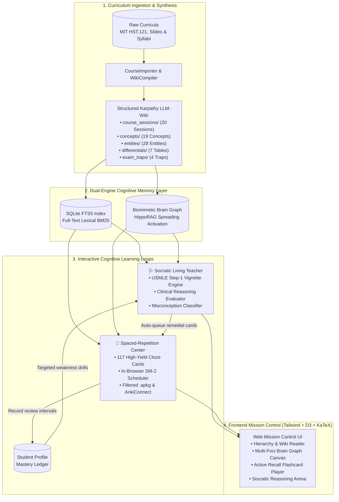
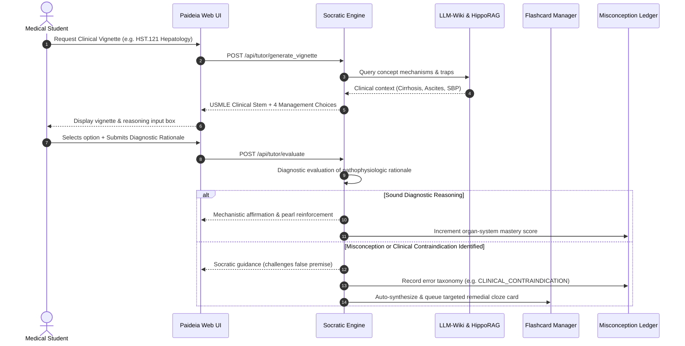
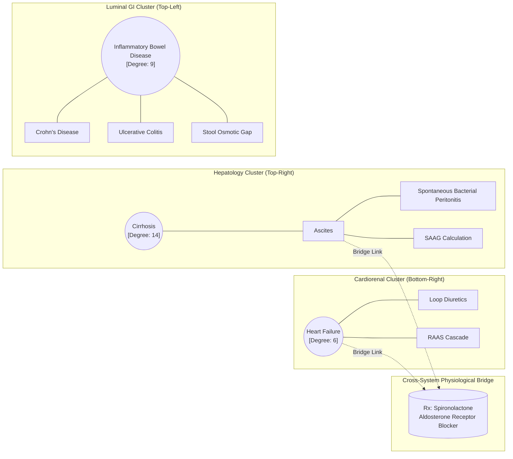

# Paideia Genesis: Living Medical Teacher & Compounding LLM-Wiki

<div align="center">

```
   ____       _     _      _          ____                       _     
  |  _ \ __ _(_) __| | ___(_) __ _   / ___| ___ _ __   ___  ___(_)___ 
  | |_) / _` | |/ _` |/ _ \ |/ _` | | |  _ / _ \ '_ \ / _ \/ __| / __|
  |  __/ (_| | | (_| |  __/ | (_| | | |_| |  __/ | | |  __/\__ \ \__ \
  |_|   \__,_|_|\__,_|\___|_|\__,_|  \____|\___|_| |_|\___||___/_|___/
                               [ M Σ ]
                      ⚕  S C O O Z I   L A B S  ⚕
```

### ⚕ Scoozi Labs &bull; Paideia Genesis ⚕
**An Autonomous Living Medical Teacher & Compounding LLM-Wiki**

[](https://www.python.org/downloads/)
[](https://fastapi.tiangolo.com)
[](https://opensource.org/licenses/MIT)
[](#curriculum-architecture)
[](#socratic-living-teacher)

*Built on Andrej Karpathy's LLM-Wiki architecture, integrating HippoRAG associative retrieval, Socratic clinical reasoning diagnosis, and SuperMemo-2 active recall.*

</div>

---

## 🌟 Overview

Medical education is overwhelmed by fragmented resources: 100+ lecture decks weekly, First Aid, Pathoma, UWorld question banks, and 30,000-card Anki decks. Students waste hundreds of hours manually copy-pasting notes and cross-referencing disjointed systems.

**Paideia Genesis transforms this experience into a compounding cognitive engine:**
1. **From Static RAG to Compounding LLM-Wiki**: Ingests syllabi and lecture slides to build an evolving, hyperlinked medical knowledge base (`course_sessions/`, `concepts/`, `entities/`, `differentials/`, `exam_traps/`).
2. **Cognitive Biomimetic Brain Graph**: Visualizes disease mechanisms as multi-foci organ-system constellations (Hepatology, Luminal GI, Gastroduodenal, Pancreaticobiliary, Cardiorenal) with interactive 1-hop and 2-hop biological pathway spotlighting.
3. **Socratic Living Teacher**: Evaluates clinical reasoning, diagnoses why mistakes happen (e.g. `CLINICAL_CONTRAINDICATION`), and automatically generates remedial flashcards.
4. **Active Recall & Spaced Repetition**: 117+ high-yield USMLE cloze deletion flashcards, in-browser interactive Study Mode with SuperMemo-2 (SM-2) intervals, 1-click AnkiConnect synchronization, and downloadable `.apkg` packages.
5. **High-Precision KaTeX Math Engine**: Flawless rendering of clinical equations ($$\text{Stool Osmotic Gap}$$, $$\text{SAAG}$$, $$\text{MELD}$$) without markdown token corruption.

---

## 🏛 System Architecture

### 1. End-to-End Pipeline Architecture



### 2. Socratic Clinical Diagnostic Flow



### 3. Biomimetic Organ-System Multi-Foci Graph Topology



---

## 🚀 Quick Start

### 1. Prerequisites
- Python 3.11+
- Virtual environment (`venv`)

### 2. Installation
```bash
# Clone the repository
git clone git@github.com:mekashef/paideia-genesis.git
cd paideia-genesis

# Create and activate virtual environment
python3 -m venv .venv
source .venv/bin/activate

# Install dependencies
pip install -r requirements.txt
```

### 3. Launch the Application
```bash
python3 run.py
```

> [!NOTE]
> On first run, `run.py` automatically initializes the schema and seeds the complete **MIT HST.121 Gastroenterology & Hepatology** curriculum, **Cardiopulmonary** block, and **117-card Spaced-Repetition Master Deck**.

Open your browser to:
**`http://localhost:8000`**

### 4. Running the Automated Test Suite
```bash
python3 -m unittest discover tests/
```
```
..............................................................
----------------------------------------------------------------------
Ran 62 tests in 31.645s

OK
```

---

## 🧬 Feature Modules

### 1. 🗂 Compounding Medical Wiki & Multi-Curriculum Navigation
- **Curriculum Filtering**: Switch the sidebar instantly between `🌐 All Curricula`, `🎓 MIT HST.121 (GI & Liver)` (20 lectures, 19 concepts, 28 entities, 6 differentials, 3 traps), and `❤️ Cardiopulmonary & Renal`.
- **Organ System Badges**: High-contrast color-coded indicators for Gastroenterology (`GI`), Cardiology (`CV`), Renal (`Renal`), Pharmacology (`Rx`), and Infectious Disease (`Micro`).
- **In-Place Markdown Editor**: Live editing with instant reindexing and append-only audit logging (`log.md`).

### 2. 🧠 Biomimetic Cognitive Brain Graph
- **Physiological Disease Hubs**: Eliminated artificial circular spoke-wheels; graph centrality is governed by real clinical anchors:
  - *Pathophysiology of Cirrhosis* (Degree 14)
  - *Inflammatory Bowel Disease* (Degree 9)
  - *Gallstones & Biliary Disorders* (Degree 9)
  - *Acute Decompensated Heart Failure* (Degree 6)
- **Spatial Clustering**: Multi-foci D3 forces group nodes into anatomical quadrants (Hepatology top-right, Luminal GI top-left, Gastroduodenal center-left, Pancreaticobiliary bottom-left, Cardiorenal bottom-right).
- **Mechanism Spotlighting**: Click any node to highlight **1-hop direct pathways** (bright white) and **2-hop cascades** (soft blue), dimming unrelated nodes to 12% opacity.
- **Cross-System Bridges**: Molecules linking distinct systems (e.g. *Spironolactone* linking Cirrhosis Ascites and Heart Failure) are highlighted with dashed amber bridge links.

### 3. 🩺 Socratic Living Teacher Arena
- **Clinical Vignette Generation**: Step-1 / Step-2 CK clinical stems with 4 multiple-choice management options.
- **Diagnostic Reasoning Probes**: Students submit stated clinical reasoning alongside their diagnostic choice.
- **Error Taxonomy**: Classifies reasoning gaps (`CLINICAL_CONTRAINDICATION`, `DIAGNOSTIC_OVERSIGHT`, `PHARMACOLOGIC_INTERACTION`), updates the student's longitudinal misconception ledger, and auto-queues remedial flashcards.

### 4. 🎴 Spaced-Repetition Flashcard Center
- **117-Card Master Deck**: Generated from comparative differentials, board traps, entities, and lecture sessions.
- **In-Browser Interactive Study Mode**:
  - Front: Cloze deletions masked with `[ ... ]` blanks.
  - Reveal: Spacebar reveals highlighted answer and dark emerald **Clinical Pearl box**.
  - Rating: SuperMemo-2 buttons (`[1] Again`, `[2] Hard`, `[3] Good`, `[4] Easy`) schedule future review intervals.
- **1-Click Wiki Jumper**: Click **"📖 Read Concept in Wiki"** on any card to immediately navigate to that article in the wiki reader.
- **Multi-Deck Export**: Download filtered `.apkg` packages (e.g. `PaideiaGenesis__MIT_HST121_Gastroenterology.apkg`) or 1-click sync via AnkiConnect (`localhost:8765`).

---

## 🛠 Interactive Usages & Clinical Workflows

### 1. 🖥 Web Mission Control Usage Guide

1. **Course Curriculum Exploration**:
   - Open `http://localhost:8000` in your browser.
   - Use the **Curriculum Filter** dropdown in the left sidebar to toggle between `🌐 All Curricula`, `🎓 MIT HST.121 (Gastroenterology & Hepatology)`, and `❤️ Cardiopulmonary & Renal`.
   - Click through the hierarchical modules: **Course Sessions** (20 lectures), **Core Concepts** (e.g., *Pathophysiology of Cirrhosis*, *Ascites & SAAG*), **Entities & Biomarkers** (e.g., *Spironolactone*, *Serum Albumin*), and **Comparative Differentials**.
   - Notice the high-precision **KaTeX math formatting** rendering equations like:
     $$\text{Stool Osmotic Gap} = 290 - 2 \times ([\text{Na}^+]_{\text{stool}} + [\text{K}^+]_{\text{stool}})$$
     $$\text{SAAG} = [\text{Albumin}]_{\text{serum}} - [\text{Albumin}]_{\text{ascites}}$$

2. **Biomimetic Brain Graph Navigation**:
   - Click the **🧠 Brain Graph** tab in the top navigation bar.
   - Explore the physiological clusters organized into natural anatomical sectors:
     - **Hepatology** (Top-Right): Centered around *Cirrhosis* (Degree 14), *Ascites*, *Hepatorenal Syndrome*.
     - **Luminal GI** (Top-Left): Centered around *Inflammatory Bowel Disease* (Degree 9), *Crohn's*, *Ulcerative Colitis*.
     - **Gastroduodenal** (Center-Left): *Peptic Ulcer Disease*, *H. pylori*, *GERD*.
     - **Pancreaticobiliary** (Bottom-Left): *Gallstones & Cholecystitis*, *Acute Pancreatitis*.
     - **Cardiorenal** (Bottom-Right): *Heart Failure*, *RAAS System*, *Loop Diuretics*.
   - **Click any node** to trigger **HippoRAG Mechanism Spotlighting**:
     - *1-hop direct connections* illuminate in bright white.
     - *2-hop associative cascades* illuminate in soft blue.
     - All other nodes smoothly fade to 12% opacity.
   - Click the amber dashed cross-system bridge to explore how *Spironolactone* connects liver ascites management to heart failure neurohormonal blockade.

3. **Socratic Living Teacher Drills**:
   - Navigate to the **🩺 Socratic Arena** tab.
   - Click **"Generate Clinical Vignette"** to spawn a board-style clinical scenario (e.g., a patient with worsening jaundice and fever).
   - Select your diagnostic or therapeutic choice.
   - **Provide your clinical rationale** in the reasoning textarea (e.g., *"Diagnostic paracentesis must precede antibiotic administration to establish PMN count"*).
   - The Socratic engine evaluates both your choice and your underlying reasoning, identifying traps such as `CLINICAL_CONTRAINDICATION` or `DIAGNOSTIC_OVERSIGHT` without giving away the answer, and immediately stages a remedial cloze card.

4. **In-Browser Active Recall Study Player**:
   - Switch to the **🎴 Flashcards** tab.
   - Filter by deck: `All Decks`, `MIT HST.121`, or `Cardiology Block`.
   - **Active Recall Controls**:
     - **Spacebar**: Reveals the cloze deletion answer and displays the dark emerald **Clinical Pearl** reference box.
     - **Keys 1-4**: Rate your recall with SuperMemo-2 intervals (`[1] Again`, `[2] Hard`, `[3] Good`, `[4] Easy`).
     - **"📖 Read Concept in Wiki"**: Instantly jumps to the corresponding article in the Compounding Wiki.
   - Click **"Export .apkg"** to download an offline deck or **"Sync to AnkiConnect"** to push directly to your local Anki Desktop app (`localhost:8765`).

---

### 2. 🐍 Programmatic Python Usage

You can use the Paideia Genesis core engine programmatically in your own Python pipelines and Jupyter notebooks:

```python
from src.wiki.compiler import WikiCompiler
from src.wiki.course_importer import CourseImporter
from src.wiki.graph_memory import GraphMemory
from src.anki.generator import AnkiManager
from src.tutor.socratic_engine import SocraticEngine

# 1. Ingest and compile MIT HST.121 curriculum
importer = CourseImporter()
result = importer.import_mit_ocw_course()
print(f"Ingested {result['sessions_count']} sessions and {result['entities_count']} entities.")

# 2. HippoRAG Associative Spreading Activation
memory = GraphMemory()
associative_pathways = memory.find_associative_pathways(
    concept_slug="pathophysiology_of_cirrhosis", 
    max_hops=2
)
for node in associative_pathways["nodes"]:
    print(f"Node: {node['label']} (Cluster: {node['cluster']}, Degree: {node['degree']})")

# 3. Socratic Clinical Vignette & Reasoning Evaluation
tutor = SocraticEngine()
vignette = tutor.generate_vignette(course_id="HST121", difficulty="step1")
print("Clinical Stem:", vignette["stem"])

evaluation = tutor.evaluate_reasoning(
    vignette_id=vignette["id"],
    student_choice="B",
    student_reasoning="Diagnostic paracentesis must be performed before antibiotics to confirm PMN > 250/uL."
)
print("Diagnostic Feedback:", evaluation["feedback"])
print("Error Classification:", evaluation.get("error_taxonomy", "SOUND_REASONING"))

# 4. Synthesize Spaced-Repetition Deck & Export .apkg
anki_mgr = AnkiManager()
deck_path = anki_mgr.export_deck_package(course_filter="HST121")
print(f"Anki package compiled to: {deck_path}")
```

---

### 3. 🌐 REST API Examples (cURL)

**Health & Status Check**:
```bash
curl -X GET http://localhost:8000/api/status
```

**Query Biomimetic Brain Graph with Course Filter**:
```bash
curl -X GET "http://localhost:8000/api/wiki/brain_graph?course=HST121"
```

**Perform HippoRAG Associative Spreading Activation**:
```bash
curl -X GET "http://localhost:8000/api/wiki/associative_recall?slug=pathophysiology_of_cirrhosis"
```

**Generate Socratic Step-1 Clinical Vignette**:
```bash
curl -X POST http://localhost:8000/api/tutor/generate_vignette \
  -H "Content-Type: application/json" \
  -d '{"course_id": "HST121", "difficulty": "step1"}'
```

**Submit Clinical Reasoning for Diagnostic Evaluation**:
```bash
curl -X POST http://localhost:8000/api/tutor/evaluate \
  -H "Content-Type: application/json" \
  -d '{
    "vignette_id": "vig_cirrhosis_ascites_01",
    "student_choice": "B",
    "student_reasoning": "Diagnostic paracentesis must precede IV third-gen cephalosporin to document PMN count > 250."
  }'
```

**Review Flashcard via SuperMemo-2 (SM-2)**:
```bash
curl -X POST http://localhost:8000/api/anki/cards/review \
  -H "Content-Type: application/json" \
  -d '{"card_id": "card_saag_calc_01", "rating": 3}'
```

**Download Filtered Anki .apkg Deck**:
```bash
curl -O -J "http://localhost:8000/api/anki/export?course=HST121"
```

---

## 🗃 Project Structure

```
paideia-genesis/
├── demo_data/                      # Immutable raw source files for first-run bootstrapping
│   ├── Cardiology_Block_Lecture_4_Heart_Failure_and_Diuretics.md
│   ├── MS2_Cardiopulmonary_Block_Syllabus.json
│   └── Missed_Question_Sample.json
├── src/
│   ├── anki/                       # Flashcard compiler & SuperMemo-2 engine
│   │   ├── compiler.py             # Automatic cloze & differential synthesis
│   │   └── generator.py            # genanki packaging, SM-2 scheduling, AnkiConnect bridge
│   ├── api/
│   │   └── server.py               # FastAPI application & RESTful endpoints
│   ├── llm/
│   │   └── client.py               # LLM abstraction (Mock, Gemini, OpenAI/Ollama)
│   ├── tutor/
│   │   ├── socratic_engine.py      # Vignette generator & clinical reasoning evaluator
│   │   └── student_profile.py      # Mastery tracking & misconception ledger
│   ├── wiki/
│   │   ├── compiler.py             # Markdown wiki compiler
│   │   ├── course_importer.py      # MIT OpenCourseWare curriculum ingester
│   │   ├── graph_memory.py         # Biomimetic brain graph & HippoRAG memory
│   │   ├── hst121_curriculum.py    # MIT HST.121 dataset & comparative differentials
│   │   ├── hst121_full_sessions_and_entities.py # All 20 lecture sessions & 28 entities
│   │   ├── indexer.py              # SQLite FTS5 indexer & wikilink graph builder
│   │   ├── knowledge_puller.py     # On-the-fly external PubMed/web knowledge synthesis
│   │   └── schema.py               # Karpathy LLM-Wiki schema manager
│   └── config.py                   # Centralized configuration & environment variables
├── static/
│   ├── app.js                      # Application controller, D3 simulation, KaTeX engine
│   ├── index.html                  # Mission Control UI, study player, graph canvas
│   └── style.css                   # Dark mode styling, callouts, and animations
├── tests/                          # 62 automated unit & integration tests
│   ├── test_anki_compiler.py
│   ├── test_anki_export.py
│   ├── test_api_endpoints.py
│   ├── test_course_importer.py
│   ├── test_curriculum_integrity.py # 20 sessions, 28 entities, differentials, traps
│   ├── test_equation_formatting.py # KaTeX math syntax & LaTeX delimiters
│   ├── test_graph_memory.py
│   ├── test_hipporag_activation.py # HippoRAG spreading activation & cross-bridges
│   ├── test_knowledge_puller.py
│   ├── test_llm_client.py          # Zero-cost offline mock LLM client & factory
│   ├── test_sm2_algorithm.py       # SuperMemo-2 mathematical scheduling engine
│   ├── test_socratic_engine.py
│   ├── test_student_profile.py
│   ├── test_wiki_compiler_extended.py
│   └── test_wiki_indexer.py
├── .github/
│   └── workflows/
│       └── unit-tests.yml          # GitHub Actions CI matrix (Python 3.11 & 3.12, 100% free)
├── .gitignore                      # Excludes runtime data/, *.db, *.apkg, and .venv/
├── LICENSE                         # MIT License
├── requirements.txt                # Python dependencies
└── run.py                          # Self-bootstrapping entry point
```

---

## 📡 API Reference

| Endpoint | Method | Description |
|---|---|---|
| `/api/status` | `GET` | Health check, total wiki page count, days to exam, flashcard count |
| `/api/wiki/tree` | `GET` | Course-filtered hierarchical tree of sessions, concepts, entities, and traps |
| `/api/wiki/page` | `GET`, `PUT` | Read and live-edit any markdown note in the Compounding Wiki |
| `/api/wiki/brain_graph` | `GET` | Multi-foci brain graph nodes and links (supports `?course=` and `?layer=`) |
| `/api/wiki/associative_recall` | `GET` | HippoRAG spreading activation from concept slug |
| `/api/wiki/quick_capture` | `POST` | Weave student clinical note into Wiki and stage flashcard on-the-fly |
| `/api/wiki/pull_external` | `POST` | On-the-fly clinical knowledge pull and synthesis |
| `/api/course/import_url` | `POST` | Ingest and compile MIT OpenCourseWare syllabus |
| `/api/tutor/generate_vignette`| `POST` | Generate adaptive Step-1 clinical vignette |
| `/api/tutor/evaluate` | `POST` | Socratic diagnosis of student reasoning and auto-remediation |
| `/api/anki/cards` | `GET` | Filtered flashcards with deck retention statistics |
| `/api/anki/cards/review` | `POST` | Record SuperMemo-2 review rating (`Again`, `Hard`, `Good`, `Easy`) |
| `/api/anki/compile_from_wiki` | `POST` | Trigger full automated compilation across wiki modules |
| `/api/anki/export` | `GET` | Download compiled `.apkg` deck (supports `?course=`) |
| `/api/anki/sync_ankiconnect` | `POST` | 1-click sync to local Anki Desktop instance |

---

## 📄 License

This project is licensed under the [MIT License](LICENSE).
